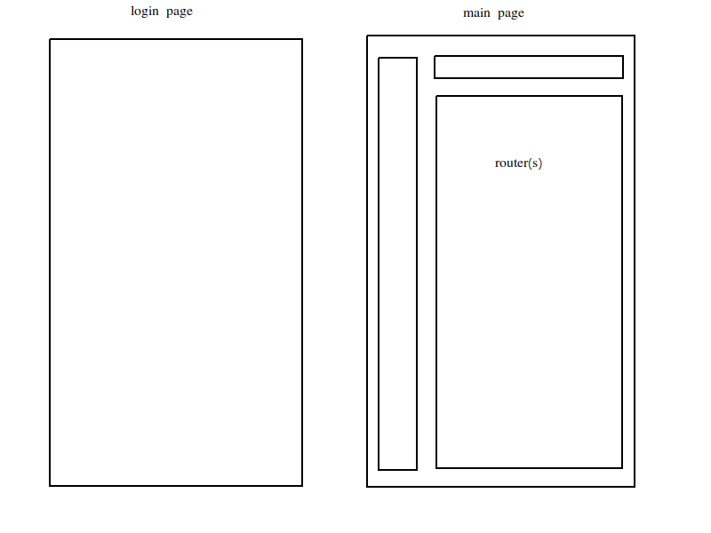

# mgmt-system

## UI 框架 element-ui
文档链接[点击这里](https://element.eleme.cn/#/zh-CN/component/installation)

安装
```bash
npm i element-ui -S
```

在项目中引入element ui, 编辑```main.js```
```typescript
import Vue from 'vue';
import ElementUI from 'element-ui';
import 'element-ui/lib/theme-chalk/index.css';  // 样式
import App from './App.vue';

Vue.use(ElementUI);

new Vue({
  el: '#app',
  render: h => h(App)
});
```

## 粗略的路由分析


需要维护2类路由
- 不需要权限的路由
- 需要权限的路由

## Mock数据
在开发环境中使用Mock模拟后端数据
```bash
npm i mockjs -D
```

## Login页面

## 绘图
使用echarts进行画图

安装
```bash
npm i echarts
```

使用echarts画图的粗略步骤

1. 引入echarts库
2. 准备一个dom容器，图表放到这个容器里面
3. 配置
4. setOption生成图表

## Mixin混入
可以在js文件中按照vue配置那样写代码,包括生命周期函数, data, methods, ......

实例, 面包屑导航的混入:
```javascript
// @/mixins/BreadCrumb.js
export default{
    data() {
        return {
            breadList: [],
        }
    },
    created(){
        this.getBreadCrumb();
    },
    watch:{
        $route() {
            this.getBreadCrumb();
        }
    },
    methods: {
        getBreadCrumb() {
            this.breadList = this.$route.meta.bread || []
        }
    }
}
```

引入:
```javascript
import BreadCrumb from '@/mixins/BreadCrumb';
export default {
    mixins: [BreadCrumb],
};
```

## moment插件做日期格式化
```bash
npm i moment
```

```javascript
d = new Date();
moment(d).format("YYYY-MM-DD");
```

## keep-alive功能
1. 包裹动态组件,让动态组件不被销毁
2. 包裹路由视图router-view, 原路由不销毁

## clearCache函数，主动销毁缓存
```javascript
clearCache() {
    let vnode = this.$vnode;
    let parentVnode = vnode && vnode.parent;
    if (
        parentVnode &&
        parentVnode.componentInstance &&
        parentVnode.componentInstance.cache
    ) {
        var key = vnode.key == null ? vnode.componentOptions.Ctor.cid + (vnode.componentOptions.tag ? `::${vnode.componentOptions.tag}` : "") : vnode.key;
        var cache = parentVnode.componentInstance.cache;
        var keys = parentVnode.componentInstance.keys;
        if (cache[key]) {
            this.$destroy();
            if (keys.length) {
                var index = keys.indexOf(key);
                if (index > -1) {
                    keys.splice(index, 1);
                }
            }
            cache[key] = null;
        }
    }
}
```

## 缓存的组件多出来的生命周期
1. activated() 当缓存组件被激活的时候触发
2. deactivated() 当缓存组件失活的时候触发

## 权限控制
误区: 让后端根据不同账号返回不同的菜单列表，这么做，即使界面上不显示相关菜单和跳转，用户依然可以通过在浏览器地址栏输入指定url访问页面
权限控制的关键: 路由的控制，给不同的账号创建不同的路由